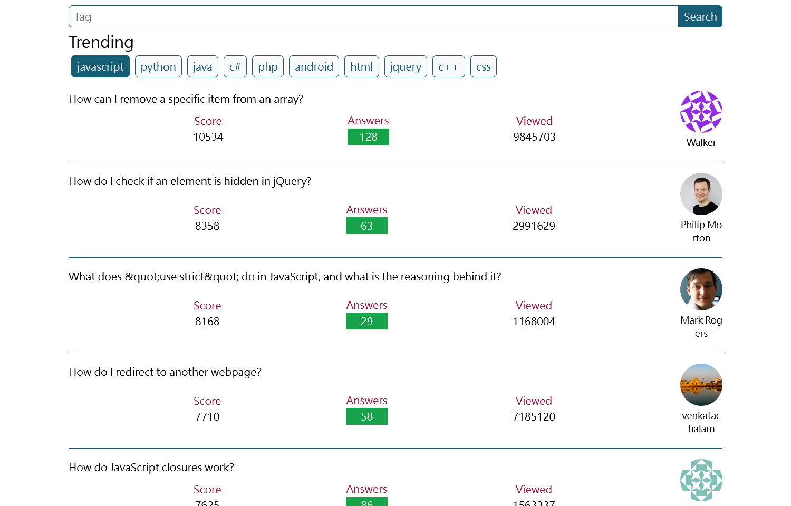
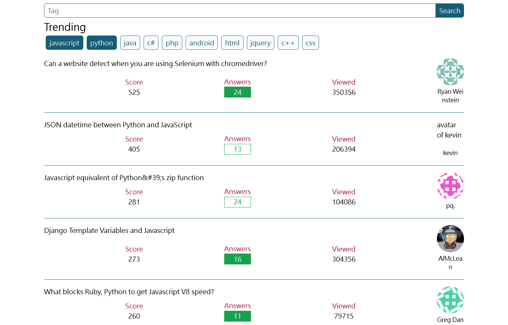
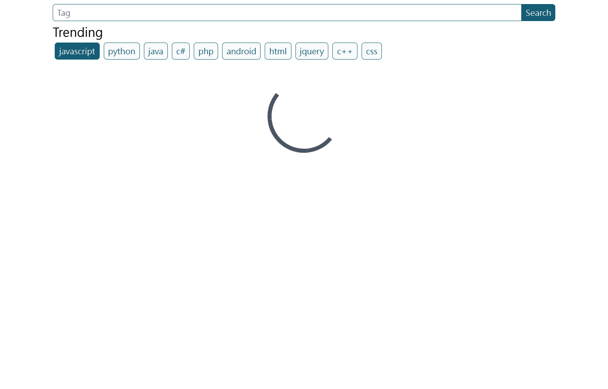

# StackOverflow Viewer

## Project Preview




- - -

## This project is currently built on
* [Vite](https://vitejs.dev/)
* [Vue3](https://vuejs.org/)
* [TypeScript](https://www.typescriptlang.org/)
* [Tailwind CSS](https://tailwindcss.com/)

- - -

## Completed Requirements
### Trending Tags
1. :heavy_check_mark: Display top 10 trending tags
2. :heavy_check_mark: Data can be found using this (https://api.stackexchange.com/docs/tags)
3. :heavy_check_mark: Default selected the first tag.
4. :heavy_check_mark: Use a round corner for tag border.
### Question Listing
1. :heavy_check_mark: The question list data can be found using this
(https://api.stackexchange.com/docs/questions) with the selected tag as the filter.
2. :heavy_check_mark: Support infinite scrolling (20 questions per fetch) and lazy load.
3. :heavy_check_mark: When scrolling down the list, the “Trending Tags” section shall scroll together.
4. :heavy_check_mark: Clicking a question will open a new tab to the question link.
5. :heavy_check_mark: Highlight the score when it is below zero
6. :heavy_check_mark: Highlight the answers with border only when it has more than 1 answer but not accepted.
7. :heavy_check_mark: Highlight the answers when it has more than 1 answer and accepted.
8. :heavy_check_mark: Apply round corner for user profile picture.
### Searching
1. :heavy_check_mark: The search will apply searching to trending tags.
2. :heavy_check_mark: The search bar is located at the top of the page, even when the list is scrolling.
3. :heavy_check_mark: Search is performed when the keyword is typed, trending tags and listing shall update
accordingly.

- - -

## Usage Guide
1. Install `yarn` (https://yarnpkg.com/getting-started/install)
2. Install project dependencies
```
yarn
```
3. Build project
```
yarn build
```
4. Preview project at local machine
```
yarn preview
```
Then, open the browser, and type `localhost:8080` to view the result.

- - -

## Project Directory Explanation
    /src               - root directory of source code
    /src/components    - view component files
    /src/utils         - share functions
    /src/service       - API
    /src/styles        - CSS style
    /src/types         - share TypeScript type definition
    /src/constants     - share constant
